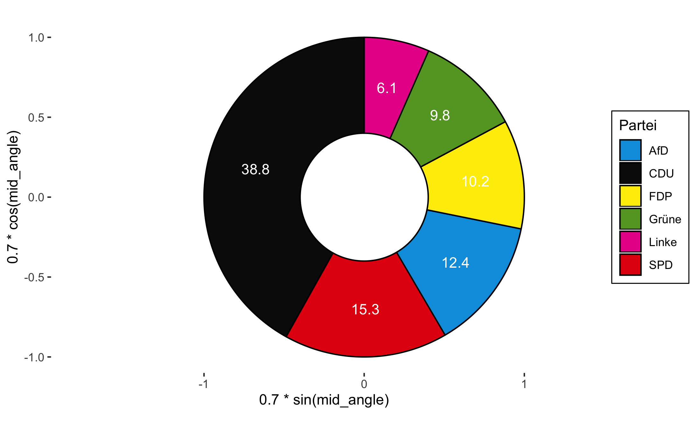
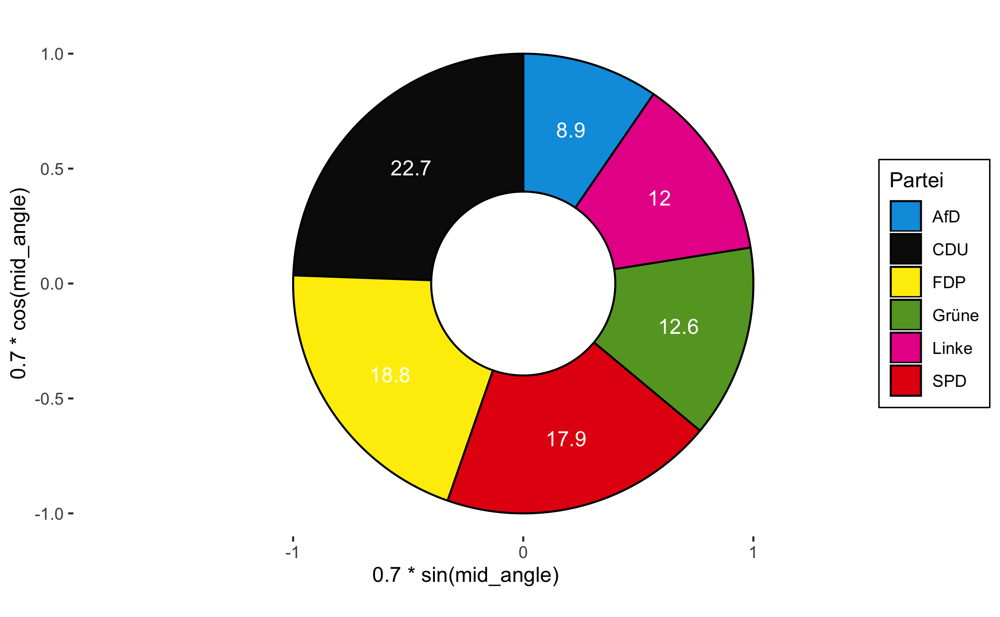
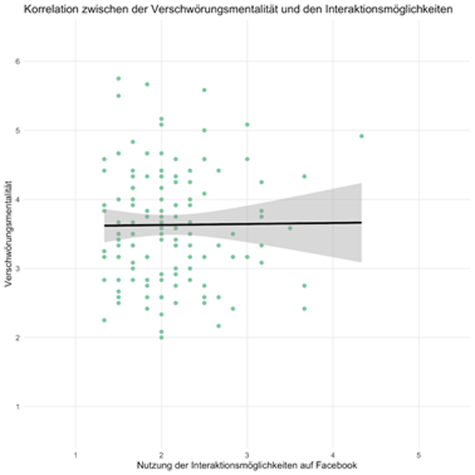

```{r setup, include=FALSE}
knitr::opts_chunk$set(echo = FALSE)
```
## Seminar Informationsvisualisierung 

### Wahlergebnisse Bundestagswahl 2017 nach Bundesland






## Seminar Usability, User Diversity und Technikakzeptanz

Studie zum Zusammenhang von Ausprägung der Verschwörungsmentalität und einer passiveren oder aktiveren Nutzung der Interaktionsmöglichkeiten von Facebook

### Verschwörungsmentalität auf Facebook


